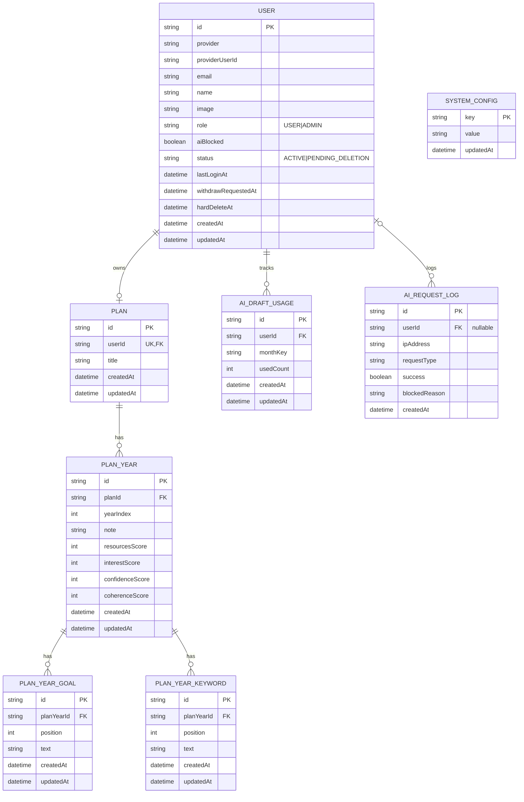

# ERD (Prisma 기준)

아래 ERD는 현재 `prisma/schema.prisma` 기준입니다.

## 참고 제약조건

- `User`: `@@unique([provider, providerUserId])`
- `Plan`: `userId @unique` (사용자당 플랜 1개)
- `PlanYear`: `@@unique([planId, yearIndex])`
- `PlanYearGoal`: `@@unique([planYearId, position])`
- `PlanYearKeyword`: `@@unique([planYearId, position])`
- `AiDraftUsage`: `@@unique([userId, monthKey])`

