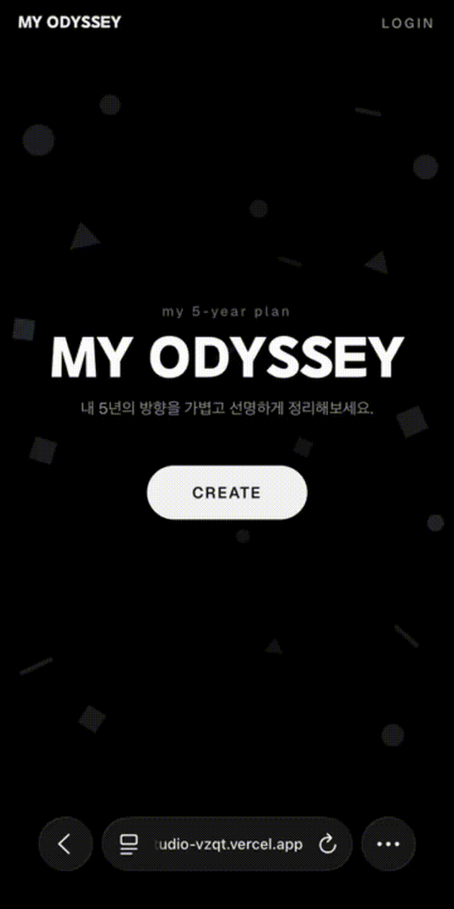
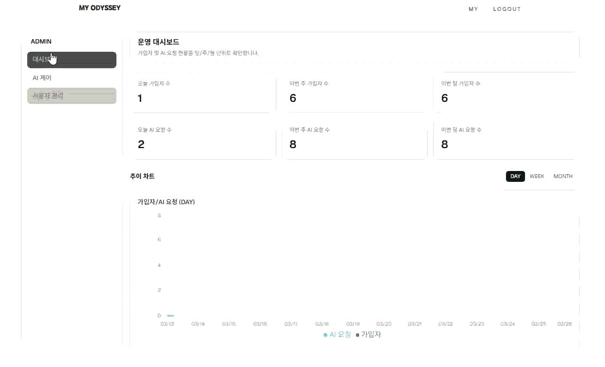

# My Odyssey

프로젝트 기간: 2026-03-20 ~ 2026-03-24

5년 플랜(Year 1~5)을 “인터뷰 기반 초안 생성”으로 만들고, 사용자가 이후 직접 다듬고 편집할 수 있는 서비스입니다.

이 프로젝트는 Next.js(App Router) + NextAuth + Prisma(PostgreSQL) 기반이며, AI 초안 생성에는 월간 쿼터/차단 정책과 운영용 어드민 대시보드가 포함됩니다.

현재 기능 완료 상태이며, 추후 리팩토링이 가능한 구조로 개선해왔습니다.

---

## 주요 기능

- 인증/세션: NextAuth (Google, Kakao)
- 플랜 생성 흐름
  - `/plan/new`: 시작 방식 선택(가이드 AI vs 수동)
  - `/plan/new/ai`: “AI와 함께 방향 찾기” 인터뷰 UI
  - `/plan/new/manual`: 수동 입력/작성 UI
  - `/plan/edit`: 편집 UI
  - `/my-plan`: 내 플랜 보기
- AI 초안 생성
  - `POST /api/odyssey/generate`: OpenAI 호출 전 월간 쿼터/차단/전역 OFF 검증
  - `GET /api/odyssey/quota`: “이번 달 남은 횟수 + 차단 상태”를 프론트에 제공
- 운영/어드민
  - `/admin/dashboard`: 가입자/AI 요청 KPI + 일/주/월 추이(Recharts)
  - `/admin/ai-control`: 전역 AI ON/OFF + 사용자별 `aiBlocked` 제어
  - `/admin/users`: 사용자 목록과 AI 차단 상태
- 탈퇴/데이터 정리
  - `POST /api/account/withdraw`: 사용자 상태를 `PENDING_DELETION`으로 전환
  - `POST /api/internal/users/withdrawal-cleanup`: 내부 토큰 기반으로 유예 만료 사용자 하드 삭제

---

## 기술 스택

- Next.js 16.2.0 (App Router)
- React 19
- NextAuth 4 (OAuth2)
- Prisma 7 + PostgreSQL
- Tailwind CSS
- Framer Motion (인터뷰/패널 애니메이션)
- Recharts (어드민 차트)
- OpenAI (초안 생성)
- Puppeteer (PDF 렌더링)

---

## 배포 스택

- 플랫폼: Vercel (Next.js App Router 서버/서버리스 실행)
- 런타임 DB 접근: Prisma Client + `@prisma/adapter-pg`
- 운영 DB: Supabase Postgres (Transaction Pooler `:6543` 권장)
- 마이그레이션: Prisma Migrate (`npx prisma migrate deploy`)
- 인증: NextAuth (Vercel 환경변수 기반 OAuth 클라이언트 설정)
- 배포 필수 환경변수: `DATABASE_URL`, `DIRECT_URL`, `NEXTAUTH_SECRET`, OAuth Provider 키들, `OPENAI_API_KEY`, `WITHDRAWAL_CLEANUP_SECRET`


---

## 환경 변수

### 인증 / 앱 URL
- `NEXTAUTH_SECRET`: NextAuth 세션 서명 및 토큰 검증용 비밀 키
- `NEXTAUTH_URL`: NextAuth 요청 처리 기준 URL
- `NEXT_PUBLIC_APP_URL`: 배포된 서비스의 기본 URL

### 데이터베이스
- `DATABASE_URL`: PostgreSQL 연결 문자열

### OAuth Provider
- `GOOGLE_CLIENT_ID`, `GOOGLE_CLIENT_SECRET`: Google OAuth 로그인용 키
- `KAKAO_CLIENT_ID`, `KAKAO_CLIENT_SECRET`: Kakao OAuth 로그인용 키

### 외부 연동 / 내부 작업
- `OPENAI_API_KEY`: OpenAI API 호출용 키
- `WITHDRAWAL_CLEANUP_SECRET`: 내부 회원 정리(cleanup) API 인증용 토큰

---

## Screen Flow

My Odyssey는 사용자가 5년 플랜을 직접 작성하거나,  
AI 인터뷰 기반으로 초안을 생성한 뒤 수정·완성할 수 있도록 설계했습니다.

아래는 실제 사용자 흐름 기준으로 정리한 주요 화면입니다.

### 1. Landing / Authentication

서비스 첫 진입 화면입니다.

<p align="center">
  
</p>

플랜 생성 여부에 따라 랜딩 화면은 다음과 같이 달라집니다.

<table>
  <tr>
    <th>Landing Page (Non Create)</th>
    <th>Landing Page (Created)</th>
  </tr>
  <tr>
    <td></td>
    <td></td>
  </tr>
</table>

| 화면 | 설명 | Asset |
|---|---|---|
| Landing Page & Login/Join (Dark Mobile) | 모바일 환경의 랜딩 및 Login/Join 화면 (Google, Kakao OAuth2 로그인/회원가입) |  |

### 2. Plan Creation Flow

| 화면 | 설명 | Asset |
|---|---|---|
| New Create (AI) | 사용자가 AI 기반 플랜 생성을 선택하는 시작 화면 |  |
| Create with AI (Draft 1) | 인터뷰 답변을 바탕으로 5년 플랜 초안을 생성하는 과정 |  |
| Create with AI (Draft 2) | 생성된 초안을 확인하고 저장된 My Plan을 확인하는 화면 |  |
| Created / New Create | 이미 플랜을 생성한 사용자가 새 플랜 작성을 다시 시작할 수 있는 화면 |  |

### 3. Plan Edit / My Plan

| 화면 | 설명 | Asset |
|---|---|---|
| Edit My Plan (Desktop) | 생성된 플랜을 확인하고 수정할 수 있는 데스크톱 화면 |  |
| Edit My Plan (Mobile) | 모바일 환경에서 플랜을 조회·편집하는 화면 |  |

### 4. Admin / Operations

| 화면 | 설명 | Asset |
|---|---|---|
| Dashboard | 가입자 수, AI 요청 지표, 추이 데이터를 확인하는 운영 대시보드 |  |
| AI Control | 사용자별 AI 인터뷰 생성 차단 및 전역 AI 사용 제어 화면 |  |

---

## 문서

- 전체 API: [`API.md`](./API.md)
- 데이터 모델 ERD: [`ERD.md`](./ERD.md)

---

## 로컬 개발

```bash
npm run dev
```

기본 접속: `http://localhost:3000`

---
